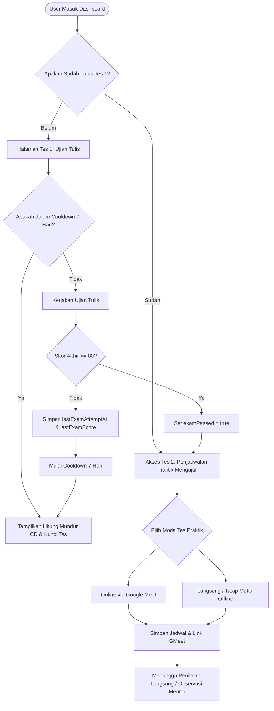

# Dokumentasi Struktur Backend & Aturan Bisnis Ujian

Dokumen ini menjelaskan struktur repositori backend (`Product`), skema data, endpoint API, serta alur logika bisnis pendaftaran ujian, batas kelulusan (>= 80), masa tunggu (*cooldown* 7 hari jika gagal), dan pemblokiran tes tahap kedua (praktik mengajar) sebelum lulus tes pertama.

---

## 📂 Struktur Repositori Backend (`Product`)

Backend ini dibangun menggunakan **Node.js** dengan framework **Express.js** dan menggunakan JSON database berbasis berkas (`db.json`) untuk penyimpanan lokal.

```text
Product/
├── src/
│   ├── models/
│   │   └── schema.js         # Skema data & objek validasi
│   ├── routes/
│   │   ├── auth.js           # Endpoint login & registrasi (JWT)
│   │   ├── educators.js      # Endpoint manajemen profil pengajar
│   │   ├── qualifications.js # Endpoint pengajuan berkas & status seleksi
│   │   └── assessments.js    # Endpoint penilaian tes tulis & tes praktik
│   ├── services/
│   │   └── authService.js    # Logika enkripsi, token JWT, & middleware auth
│   └── store/
│       ├── db.js             # Engine database JSON (generic CRUD)
│       ├── db.json           # File penyimpanan data ter-persist
│       └── seed.js           # Seeding awal untuk data demo
├── .env                      # Variabel lingkungan (port, JWT secret)
├── index.js                  # Entrypoint server express
└── BACKEND_STRUCTURE.md      # [DOKUMEN INI] Panduan struktur & aturan bisnis
```

---

## 🗄️ Rancangan Skema Data Tambahan (Database Schema)

Untuk mendukung alur **Tes Tulis (Ujian Mock)**, **Cooldown 7 Hari**, dan **Tes Praktik**, kita perlu memperluas skema di `src/models/schema.js` dengan entitas sebagai berikut:

### 1. Perubahan pada `User` Schema
Menambahkan properti untuk mencatat status ujian tulis terakhir:
```javascript
export const UserSchema = {
  id: '',
  name: '',
  email: '',
  password: '',
  role: 'teacher',
  createdAt: '',
  
  // Penambahan atribut tracking ujian tulis
  examPassed: false,          // True jika nilai ujian >= 80
  lastExamScore: null,        // Skor angka ujian terakhir (0 - 100)
  lastExamAttemptAt: null,    // Timestamp ISO dari percobaan ujian terakhir
};
```

### 2. Modifikasi pada `QualificationSubmission`
Menyimpan informasi pendaftaran untuk Tes Praktik Mengajar (Tes Kedua):
```javascript
export const QualificationSubmissionSchema = {
  id: '',
  teacherId: '',
  status: 'draft',            // 'draft' | 'submitted' | 'under_review' | 'approved' | 'rejected'
  documents: [],              // Unggahan berkas wajib
  
  // Detail Tes Kedua (Praktik Mengajar)
  practiceSchedule: {
    mode: 'online',           // 'online' (GMeet/Zoom) | 'offline' (Langsung)
    date: '',                 // YYYY-MM-DD
    time: '',                 // HH:MM
    link: null,               // Link GMeet jika moda online
    location: null,           // Lokasi gedung jika moda offline
  },
  
  scores: {
    akademik: 0,
    pengalaman: 0,
    kompetensi: 0,            // Nilai dari praktik mengajar
  },
  totalScore: 0,
  adminNotes: '',
  reviewedBy: null,
  submittedAt: null,
  reviewedAt: null,
  createdAt: '',
};
```

---

## 🧠 Alur Aturan Bisnis Ujian (Business Logic Flow)



### 1. Batas Kelulusan & Cooldown (CD) Ujian Pertama
*   **Syarat Lulus:** Calon pengajar wajib mendapatkan nilai **minimal 80 poin** pada Ujian Tulis (Tes Pertama).
*   **Mekanisme Gagal:** Jika skor < 80, pengajar dinyatakan **gagal**. Sistem akan mencatat timestamp saat ujian selesai di `lastExamAttemptAt`.
*   **Cooldown 7 Hari:** Sistem secara otomatis mengunci tombol ujian kembali selama **7 hari** (7 x 24 jam atau 168 jam). 
*   **Rumus Sisa Waktu Cooldown (Frontend & Backend):**
    $$\text{Sisa Waktu} = (\text{lastExamAttemptAt} + 7\text{ Hari}) - \text{Waktu Sekarang}$$
    Jika nilai di atas positif, akses ujian dikunci dan user diperlihatkan hitung mundur (*countdown*).

### 2. Gerbang Validasi Tes Kedua (Prerequisite Gate)
*   User **tidak diizinkan** melakukan pemesanan jadwal praktik mengajar online (GMeet) atau offline (langsung/tatap muka) sebelum `examPassed` bernilai `true`.
*   Jika user mencoba mengakses API atau UI pengajuan jadwal sebelum lulus tes tulis, server backend akan membalikkan pesan error:
    `403 Forbidden: Anda harus lulus Ujian Tulis (Skor >= 80) sebelum mengambil Tes Praktik Mengajar.`

---

## 🔗 Endpoint API Backend yang Dibutuhkan

Berikut adalah modifikasi/penambahan endpoint API untuk mendukung aturan bisnis ini:

### 1. `POST /api/exam/submit` (Tes Pertama)
*   **Akses:** Terotentikasi (Teacher)
*   **Fungsi:** Mengirim jawaban ujian tulis, menghitung nilai, dan mengatur status kelulusan/cooldown.
*   **Logika Backend:**
    1.  Cek sisa cooldown berdasarkan `lastExamAttemptAt`. Jika masih dalam sisa waktu < 7 hari, kembalikan error `400 Bad Request` dengan sisa waktu.
    2.  Hitung skor jawaban.
    3.  Update data user:
        *   `lastExamScore = skor`
        *   `lastExamAttemptAt = waktu_sekarang`
        *   Jika `skor >= 80`, set `examPassed = true`.
    4.  Kembalikan respon hasil ujian.

### 2. `POST /api/qualifications` (Tes Kedua)
*   **Akses:** Terotentikasi (Teacher)
*   **Fungsi:** Melakukan pendaftaran/penjadwalan tes praktik mengajar.
*   **Logika Backend:**
    1.  Cek data user di DB. Jika `examPassed !== true`, kembalikan error `403 Forbidden` (*"Anda belum lulus ujian tulis"*).
    2.  Simpan jadwal praktik mengajar (`practiceSchedule`) berupa moda (`online`/`offline`), tanggal, dan waktu.
    3.  Jika moda `online`, buatkan tautan Google Meet dinamis (atau dummy link). Jika moda `offline`, lampirkan petunjuk lokasi gedung evaluasi.
